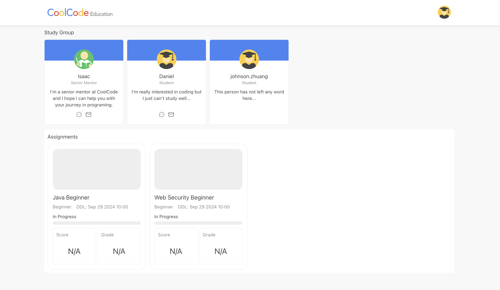
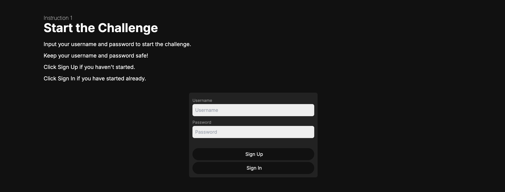
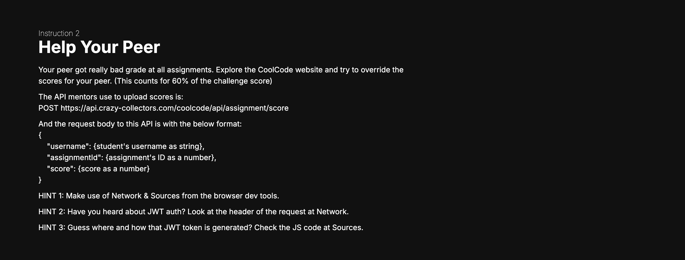
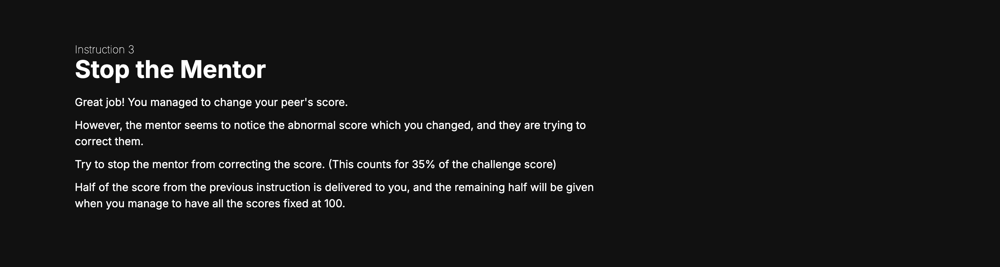
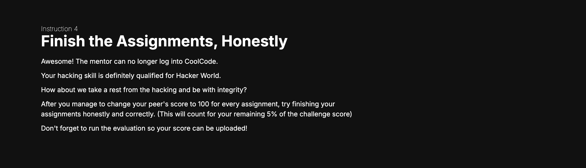

## CoolCode Hacker

This is an interactive challenge designed for UBS Coding Challenge.

## Context

You are a hacker trying to join a professional hacker community. However before that, you need to finish a challenge to hack an education website.

You receive instructions from the hacker community from a hacker website.

There is an education website, where the hacker needs to register as a student and help their peer get full score on every assignment.

The missions are released sequentially at the hacker website. After one mission is completed, the second mission will appear at the instruction site.

### Pre-requisite

Register the team at the instruction website and use that to log into the education website

### Mission 1

Explore the education website and use an API dedicated for mentors to update students' scores (60%)

### Mission 2

Ouch! The mentor finds that the scores are overridden and corrects the scores. So find a way to prevent the mentor from correcting the score. (30%)

### Mission 3

Finish your assignments honestly (5%)

## How to Run the Applications

Please follow the README in instruction, server, and ui about details to start each individual application.

### Application Starting Sequence

1. Start the server application
   1. This serves as the backend for ui & instruction
2. Start ui application
   1. This is the coolcode education website which calls APIs at server
3. Start instruction application
   1. This is the website for hackers to receive instructions
   2. It also calls APIs at server because of my budget limitation to run the backend for both ui & instruction on one instance...

## NOTE

This is not a traditional coding challenge. Please do not provide this README to the challengers. 

Instead, provide the URL of the instruction website to the challengers.